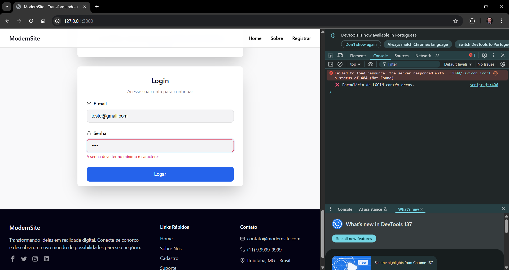
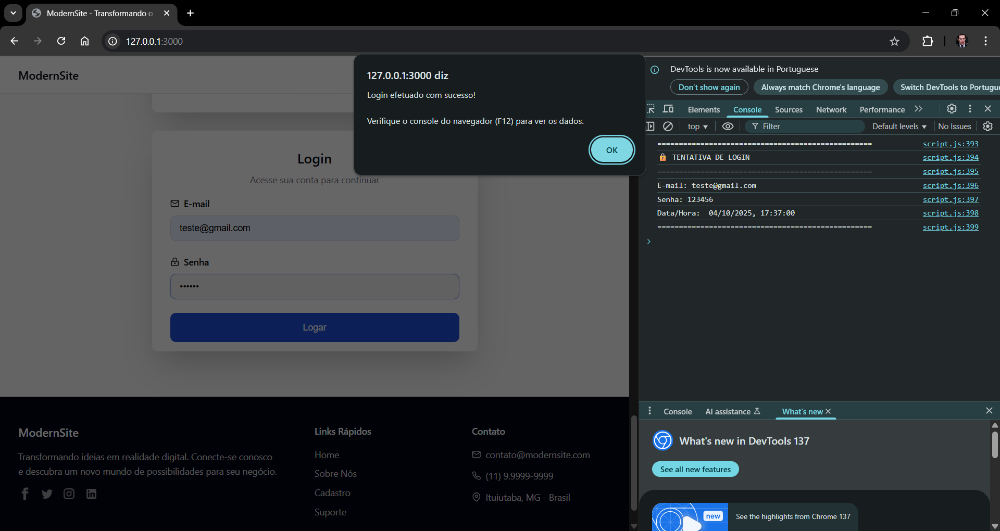
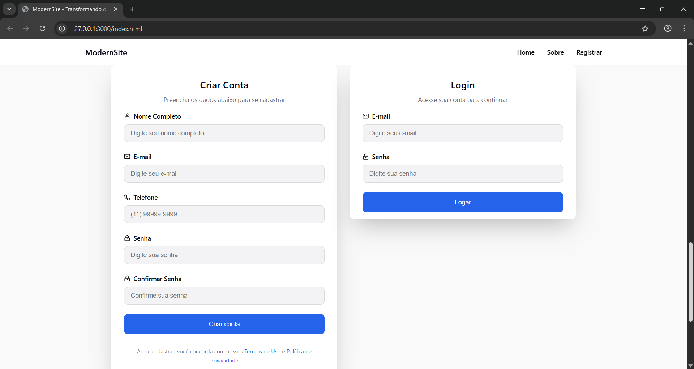

# Projeto ModernSite - Página de Cadastro e Login

Este é um projeto de desenvolvimento web front-end feito para a matéria de Programação para Internet, esse é um fork do projeto original com os aprimoramentos pedidos. O projeto foi desenvolvido como parte de um trabalho acadêmico, utilizando HTML, CSS e JavaScript puros.

## Adição de Funcionalidades

-   **Formulário de Login**:
    -   Validação para e-mail e senha.
    -   A senha deve ter no mínimo 6 caracteres.
    -   Exibição dos dados de login no console do navegador ao submeter o formulário.

    

    

-   **Layout Lado a Lado**: Em telas maiores, os formulários de cadastro e login são exibidos um ao lado do outro para uma melhor experiência do usuário.

    
